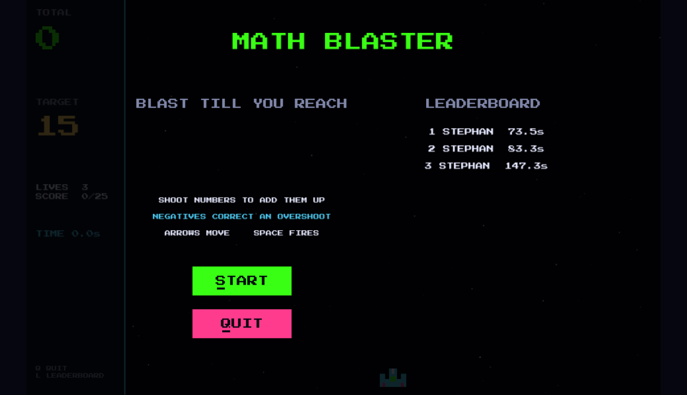
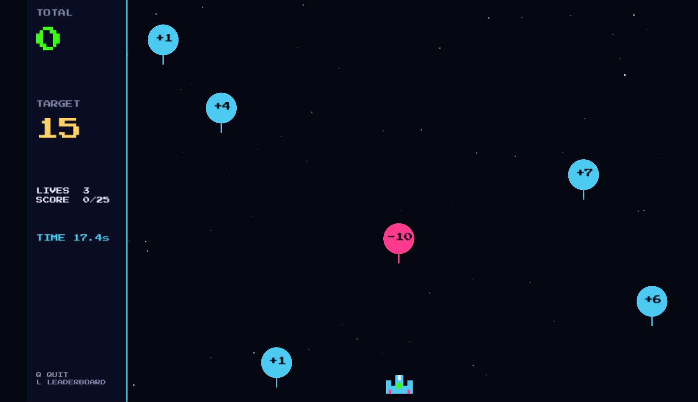
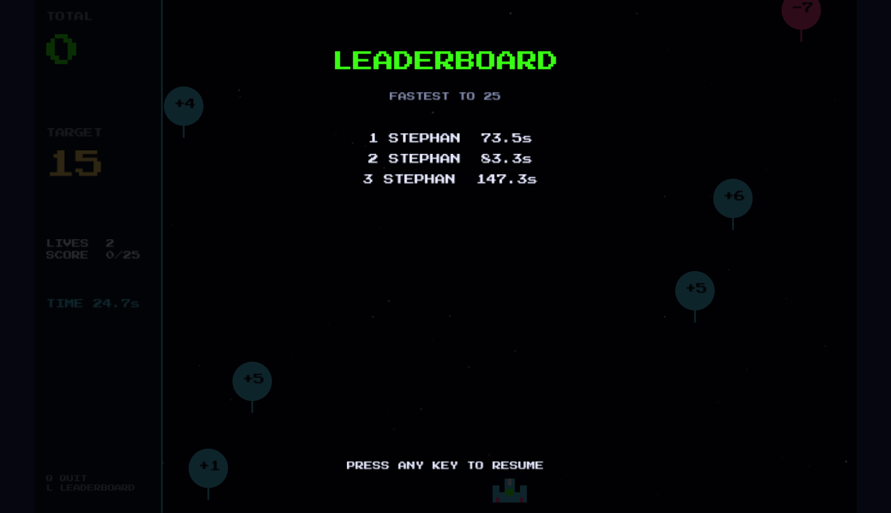

# Math Blaster

A retro arcade shooter where the ammo is arithmetic. Hit a **target** number by
blasting falling numbers and adding them up, but don't let them reach your ship.
It's mental math disguised as an 80s space game.

## The idea

You're given a target, like **15**. Numbers drift down from the top of the screen.
Every number you shoot is **added to your running total**. Land on the target
**exactly** and you clear the round and get a new one. Simple sums, played at
arcade speed.

Some numbers are negative, so you can always correct a miss: a target of 8 can be
reached as `+4 +4` or `+9 -1`. Positives are blue, negatives are pink.

## How to play

| Key | Action |
| --- | --- |
| **Arrow keys** | Move your ship left and right |
| **Space** | Fire |
| **L** | Peek at the leaderboard |
| **Q** | Quit |

- **Shoot numbers** to add their value to your total (shown top-left).
- **Reach the target exactly** to score and move on.
- **Use negatives** to come back down if you overshoot.
- **Don't get hit.** A number that reaches your ship costs one of your three lives.

## Winning

Clear enough rounds to fill the score bar and you win the run. The clock is always
ticking, so the real challenge is finishing **fast**. Your best times go on the
leaderboard, and the fastest run sits proudly at the top.

## Tips

- Plan a couple of shots ahead: if the total is 11 and the target is 15, hunt for a
  **+4** rather than blasting the first thing you see.
- Stuck just over the target? A negative number is your friend.
- Speed matters more than safety once you're good. The leaderboard rewards the bold.

Have fun, and mind the math.
