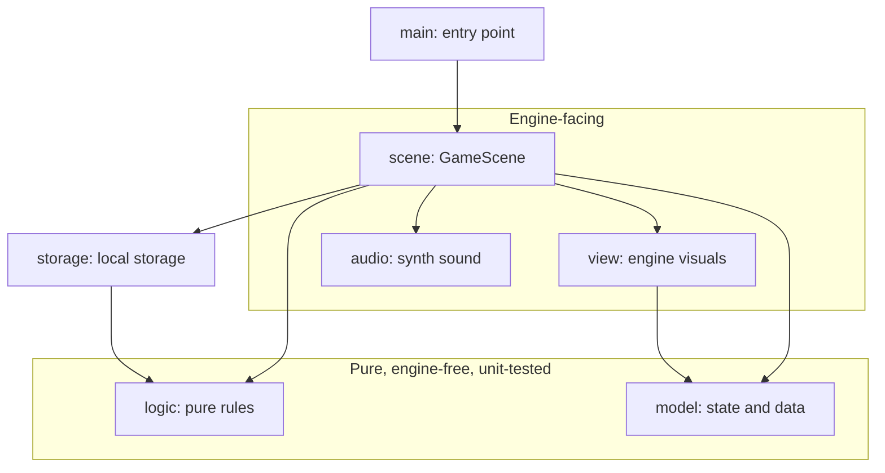

# Technical Overview

A high-level look at how Math Blaster is built and how it ends up running in your browser. For
how to *play*, see the [README](../README.md).

## Architecture

The game is organized into small, single-purpose packages, split along one important line: the
**pure game rules** know nothing about the game engine, while the **engine-facing code** does
all the drawing, input, and sound. That separation keeps the arithmetic and scoring rules simple
to reason about and fast to unit-test, independent of any graphics.

- **model** — plain data and state: the running total, target, lives, score.
- **logic** — pure rules with no engine types: evaluating a shot, generating numbers, ranking
  the leaderboard, formatting time. This is what the unit tests cover.
- **view** — everything you see, built with the engine: the ship, the falling numbers, the HUD,
  the starfield, and the overlay screens.
- **scene** — the conductor: it wires input, the per-frame loop, spawning, and collisions
  together, calling into `logic` for decisions and `view` for rendering.
- **storage** — reads and writes the leaderboard to the browser's local storage.
- **audio** — a tiny software synthesizer that generates the music and sound effects from
  waveforms, so the game ships with no audio files.



The arrows point from a package to the packages it depends on. Notice that `logic` and `model`
sit in their own engine-free box: nothing pure ever reaches up into the engine, which is what
makes the rules portable and testable.

## Kotlin and WebAssembly

The game is written in **Kotlin** and built with the **KorGE** 2D game engine. The same game
code is compiled to two targets:

- A **desktop (JVM)** build for a fast write-and-run loop while developing.
- A **WebAssembly** build, which is what players actually run.

### Kotlin Multiplatform

Targeting more than one platform from a single codebase is what **Kotlin Multiplatform** (KMP)
is for. Instead of the usual single-platform `src/main` / `src/test` layout, a KMP module
organizes code by **source set**, named `<target>Main` and `<target>Test`:

```
src/
  commonMain/kotlin/    # shared code compiled to EVERY target
  commonTest/kotlin/    # shared tests run on every target
  wasmJsMain/kotlin/    # Wasm-only glue for the web build
```

The `common*` source sets are the heart of it: anything in `commonMain` must compile to all
targets, so almost the entire game lives there, including its entry point. This is the practical
reason the pure `logic` and `model` packages stay engine-free and KorGE-light: code that compiles
cleanly to common runs unchanged on both the JVM and in the browser, and `commonTest` exercises
it the same way everywhere. The JVM (desktop dev) target runs straight from `commonMain` with no
source set of its own, while a small `wasmJsMain` holds the bit of platform glue the web build
needs. New per-target source sets follow the same `<target>Main` / `<target>Test` naming if they
are ever added.

### WebAssembly

For the web, Kotlin compiles the game to **real WebAssembly** rather than to JavaScript. It uses
the **WasmGC** flavor (WebAssembly with built-in garbage collection), which lets a managed
language like Kotlin run efficiently without shipping its own memory manager. WasmGC has been
supported by all major browsers since late 2024.

The browser loads a small bootstrap script that fetches the `.wasm` module, starts the game, and
hands it a canvas to draw on. There is no server doing any of the work: once the page has loaded,
everything (the game loop, the math, the sound synthesis, saving your times) runs locally in your
browser.

Because all of that is static, the game is published as a plain set of files (one HTML page, the
WebAssembly module, and a bit of glue) to **GitHub Pages**. A continuous-integration workflow
rebuilds and republishes it automatically whenever the main branch changes.

## The journey: building with Claude

This project was built as a game-jam entry, with Claude doing much of the hands-on work. A few
deliberate choices made that collaboration reliable rather than hit-and-miss:

- **A custom KorGE skill.** KorGE 6 is newer than most model training data, and its API has
  shifted over versions (even the package namespace moved). Rather than risk Claude inventing
  plausible-but-wrong engine calls, we taught it a dedicated **KorGE skill** (under
  `.claude/skills/korge`) with concise, current references for scenes, views, input, animation,
  resources, and project setup. Claude reaches for that skill whenever it touches engine code.

- **Project-specific Kotlin rules.** We wrote a short, path-scoped rules file
  (`.claude/rules/kotlin.md`) capturing how we want Kotlin written here: organize by feature
  package, keep the game rules free of engine types, favor small single-purpose functions, use
  parameter objects over long argument lists, and lean on idiomatic Kotlin. These rules turn
  vague "write clean code" guidance into concrete, checkable expectations.

- **Retrofitting OpenSpec.** For the jam we moved fast and plan-first (see `PLAN.md`), shipping a
  working game before formalizing anything. Afterwards we **retrofitted OpenSpec**: the
  capability specs under `openspec/specs` were written retroactively to capture how the game
  actually behaves (for example, that overshooting is allowed and lives are lost only when a
  number reaches your ship). They now serve as a living, validated baseline that any future
  change can be specified against.

The throughline: invest a little in giving the assistant accurate context (a skill), clear taste
(rules), and a durable record of intent (specs), and the day-to-day building gets faster and
steadier.
